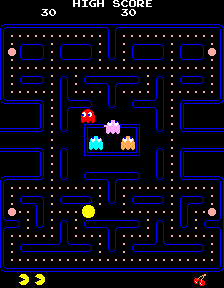
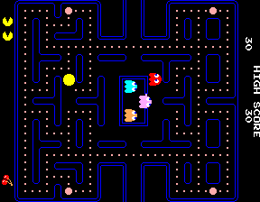

# ESP32TinyPAC
Port Arcade Pacman SDL x86 (superzazu) to ESP32 (TTGO VGA32 1.x)

 
 

<ul>
 <li>Compatible TTGO VGA32 v1.x (1.0, 1.1, 1.2, 1.4)</li>
 <li>Only SRAM (not PSRAM required)</li>
 <li>Visual Studio 1.66.1 PLATFORMIO 2.4.3 Espressif32 v3.5.0(python 3.6)</li>
 <li>Arduino IDE 1.8.11 Espressif System 1.0.6</li>
 <li>Tiny Bitluni 0.3.3 mod C fix 8 colors (Ricardo Massaro)</li>
 <li>
  Video mode 64 colors (change video mode on the fly)
  <ul>
   <li>320x240 Vertical</li>
   <li>320x350 Horizontal and Vertical</li>
   <li>400x300 Horizontal and Vertical</li>
  </ul>
 </li>
 <li>
  Keyboard PS/2
  <ul>
   <li>Left, right, up, down</li>
   <li>5 coin (slot 1)</li>
   <li>4 coin (slot 2)</li>
   <li>1 start (1p)</li>
   <li>2 start (2p)</li>
   <li>T test board</li>
   <li>P pause</li>
  </ul>  
 </li>
</ul>
